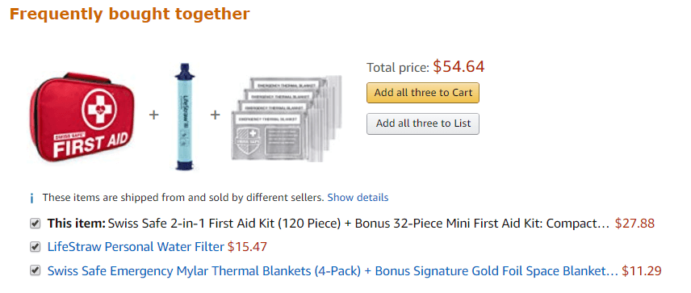
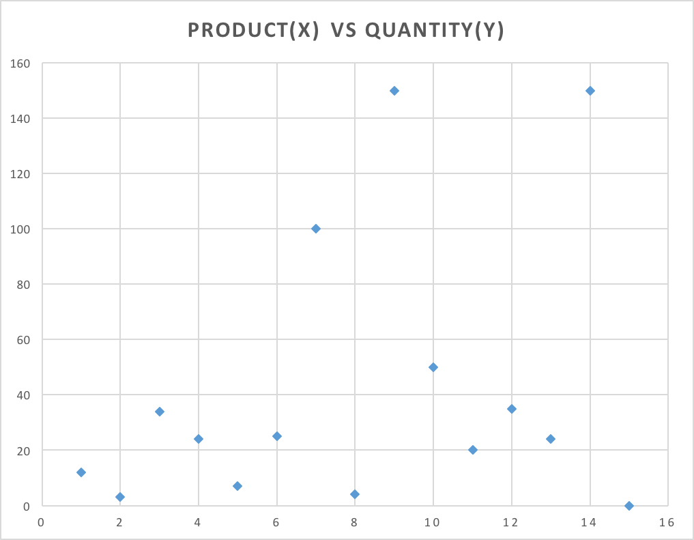

# What am I trying to build

A recommendation system that gives the users items/products which are brought together as they add items to the cart. This can be achieved by going through the purchase history of all other users. This will increase sales in general as well as the average value per order.

Eg: Amazon shows me these kinds of recommendation when I purchase bandage/medical supplies etc...

# About the project I currently work
We are an eCommerce company based out of Kuwait with a focus on baby products. 

https://play.google.com/store/apps/details?id=kuwait.yahaal&hl=en&showAllReviews=true

https://apps.apple.com/kw/app/yahaal/id1076298359

# What I have done so far

whenever someone adds an item (say **Product A**) to the cart (A virtual shopping cart in the mobile app, just like we have seen in Amazon/Flipkart etc..) I make a call to the recommendation system to bring up the recommended products for **Product A**

Then the algorithm works as follows
    
1. The software brings up all the orders which contained this particular **Product A**
    
2. Then it (the software) find and groups all the distinct products from those orders with the sum of the quantities, so I get an idea what are the products which are brought together with this Particular **Product A**

3. Then the software sort the products from the result set based on the total quantities purchased in descending order. So the most frequently purchased item comes as the topmost recommendation.

4. Then we can show these recommendations to the user as the frequently bought together items for **Product A**

# The Problem

1. Some products are sold at very high frequency, So the recommendation system always skew towards these items

    - eg: diapers, wet wipes. 
    - These items are brought in bulk volumes, say 100. So generally we don't want to recommend diapers to all the customers. The items such as food & formula are brought 2-5 quantities and we would like them to be recommended

    - But because of the high volume of the items such as diapers, the other items which are brought together are always shadowed by them.

    - Since we consider only the quantities of the items purchased, for now, I generally would like to strip this high volume product from the list/ also the super low volume products as well.

    Consider the following graph
    
    The X-axis have the products and the Y have the quantities purchased for given X.

    - For example, the product 7th, 9th, and the 14th products were purchased in high volumes, and product 15, 2 and 8 were purchased in super low volumes. Ideally, we don't want them at all in the recommendation. Instead, the products which are in the 10-60 (In Y-axis) quantities range are the sweet items. Possibly most of the customers would buy them.

# Other possible limitations of this approach
 - We are not building any correlation between the products (eg: category/subcategory)
 - No other variable other than the quantity of the item
 - No relation between the ingredients/material of the product,
 - Not considering the customers/kids age, or gender.
 - No other properties of the product are taken into consideration
 - Not considering time/season of the year 
 - Not Considering profit margin
 etc...